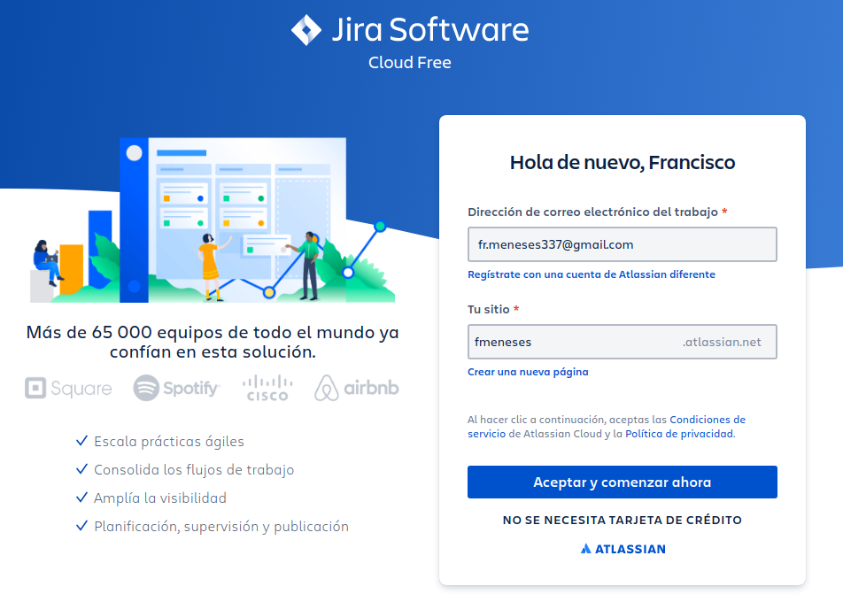
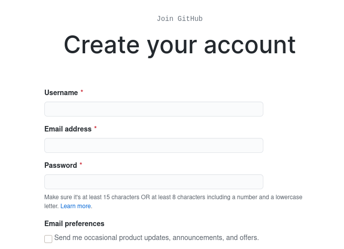
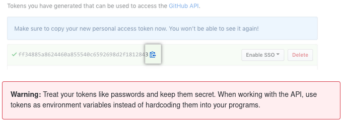

# pelorus-install

Prerequisites:
  - An OpenShift 3.11 or higher Environment (You need to have cluster administrator privileges)
  - A machine from which to run the install (usually your laptop) 
  - ansible (version 2.9)
  - Python
  - git
  - Ansible module "kubernetes.core"
  - GitHub account
  - [Jira Cloud account](#create-jira-account)

Procedure

1. Get from your OCP cluster the following variables:
~~~
Openshift API URL: <OCP_API_URL>
Openshift user with cluster admin privileges: <OCP_USER_CLUSTER_ADMIN>
Openshift password with cluster admin privileges: <OCP_PASSWORD_USER_CLUSTER_ADMIN>
Openshift apps domain: <OCP_APPS_DOMAIN>
~~~
2. Download git repo https://github.com/fmenesesg/pelorus-install/
~~~
git clone https://github.com/fmenesesg/pelorus-install/
~~~
3. In the root of this repository create "secret.yml":
~~~
ansible-vault create secret.yml
New Vault password: *****
Confirm New Vault password: *****
~~~

4. In secret.yml add the following lines with corresponding values and save:
  ~~~
  openshift_user: "<OCP_USER_CLUSTER_ADMIN>"
  openshift_password: "<OCP_PASSWORD_USER_CLUSTER_ADMIN>"
  openshift_api_url: "<OCP_API_URL>"
  openshift_apps_domain: "<OCP_APPS_DOMAIN>"
  ~~~
5. Execute the ansible playbook
- ansible-playbook site.yml -K --ask-vault 

In a few seconds, you will see a number of resources get created:

* Prometheus and Grafana operators
* The core Pelorus stack, which includes:
  * A `Prometheus` instance
  * A `Grafana` instance
  * A `ServiceMonitor` instance for scraping the Pelorus exporters.
  * A `GrafanaDatasource` pointing to Prometheus.
  * A set of `GrafanaDashboards`. See the [dashboards documentation](/docs/Dashboards.md) for more details.
* The following exporters:
  * Deploy Time

## Create Jira account

1- Access https://www.atlassian.com/es/try/cloud/signup?bundle=jira-software&edition=free and create a free account.

2- Access your account and go to https://id.atlassian.com/manage-profile/security/api-tokens and create a new token.

Steps:
  - Navigate to Jira
  - Click on your profile picture
  - Account settings
  - Security
  - Create and manage API tokens

Ensure that you save the token upon generation, as it will disapear after closing the dialog box.

## Create GitHub account

1- Access https://github.com/join?source=login and create an account.

2- Access your account:

Steps:
  - Navigate to GitHub
  - In the upper-right corner of any page, click your profile photo, then click Settings
  - In the left sidebar, click Developer settings
  - In the left sidebar, click Personal access tokens
  - Click Generate new token
  - Give your token a descriptive name
  - Select the scopes, or permissions, you'd like to grant this token. To use your token to access repositories from the command line, select repo
  - Click Generate token
  - Copy the token to your clipboard. For security reasons, after you navigate off the page, you will not be able to see the token again. 

